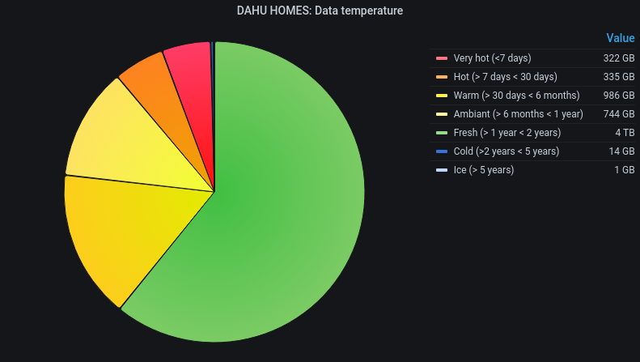

# fswalk
An efficient multiprocessing directory walk and search tool

## Introduction
fswalk is a simple python script that recursively walks through a filesystem 
directory to gather files meta-data and collect them into a **json file** or
an **Elasticsearch** database.
It runs several processes, each responsible of doing the list of the files
contained into a subdirectory.
Collected meta-data are `filename, path, uid, gid, size`,`atime`,`ctime`,`mtime`
and `temperature` \*.
The output is either a json file sent on the fly to stdout, or an Elastisearch
indexing. A simple search option is provided to retrieve files by their owner,
group or a part of the name.

The script aslo provides an option to do a quick analyze of the resulting
output file.

*warning*: When the results are sent to stdout, due to multiprocessing and not 
to slow down the thing, the json file is printed with an extra `,` sign that might 
break json compatibility.
The `pyjson5` python library allows such non-standard json file to be read.

\*: `temperature` is a calculated int value from 1 to 7 based on the 
max(mtime,atime,ctime). 1 is the coldest (>5 years) and 1 the hottest (< 7 days)

## Sample graphs that may be generated with the output produced




## Installation

Requirements:
  - python >= 3.5
  - python packages: requests, pyjson5, elasticsearch

Installing the current stable release:

```
$ pip install fswalk
```

Installing the latest devel snapshot:

```
$ pip install git+https://github.com/bzizou/fs_walk.git
```

## Example

Start a walk into the `/home/bzizou` directory with 8 process, excluding 
the `.snapshot`subdirectory and getting the result as a gzipped json file:

```
bzizou@f-dahu:~/git/fs_walk$ fswalk -p /home/bzizou -x '^/home/bzizou/\.snapshot/' -n 8 |gzip > /tmp/out.gz    
```

Analyze the output from the resulting file:

```
bzizou@f-dahu:~/git/fs_walk$ fswalk -a /tmp/out.gz
User                                       Size            Count
=================================================================
bzizou                               2749804131            11125
root                                 1030651826             1351
1000                                  390705282              476
11610                                    726417                7

Group                                      Size            Count
=================================================================
realuser                             2749795275            11119
root                                 1030660332             1356
1000                                  390705282              476
2222                                     726417                7
staff                                       350                1

TOTAL SIZE: 4171887656
TOTAL FILES: 12959
```

Same directory scan, but we index the results into an Elastisearch database:

```
bzizou@f-dahu:~/git/fs_walk$ fswalk -p /home/bzizou -x '^/home/bzizou/\.snapshot/' -n 8 --elastic-host=http://localhost:9200 --elastic-index=fs_walk_home -g
```

Do a search for all files with the "povray" string in their path name and belonging to the user which uid is 10000:

```
bzizou@f-dahu:~/git/fs_walk$ fswalk --elastic-host=http://localhost:9200 --elastic-index=fs_walk_home --search="10000:*:povray:*"
/home/bzizou/povray/OAR.cigri.14068.1251218.stderr
/home/bzizou/povray/OAR.cigri.14068.1251220.stderr
/home/bzizou/povray/OAR.cigri.14068.1251224.stderr
/home/bzizou/povray/OAR.cigri.14068.1251231.stderr
/home/bzizou/povray/OAR.cigri.14068.1251231.stdout
/home/bzizou/povray/OAR.cigri.14068.1251233.stderr
/home/bzizou/povray/OAR.cigri.14068.1251233.stdout
/home/bzizou/povray/OAR.cigri.14068.1251234.stderr
/home/bzizou/povray/OAR.cigri.14068.1251234.stdout
/home/bzizou/povray/OAR.cigri.14068.1251237.stderr
/home/bzizou/povray/OAR.cigri.14068.1251237.stdout
/home/bzizou/povray/OAR.cigri.14068.1251238.stderr
```

## Usage
```
Usage: fswalk [options]

Options:
  -h, --help            show this help message and exit
  -p PATH, --path=PATH  Path to scan
  -n NPROC, --nproc=NPROC
                        Number of process to launch
  -x EXCLUDE_EXPR, --exclude=EXCLUDE_EXPR
                        Regular expression for path exclusion
  -a ANALYZE_FILE, --analyze=ANALYZE_FILE
                        Creates a summary based on a previously generated json
                        file
  -s SEARCH_STRING, --search=SEARCH_STRING
                        Search a subset of files with syntax:
                        [uid]:[gid]:[path_glob]:[hostname] (--analyze or
                        --elastic-host needed)
  --numeric             Output numeric uid/gid instead of names
  --hostname=HOSTNAME   Overwrite the value of the hostname string. Defaults
                        to local hostname.
  -e ELASTIC_HOST, --elastic-host=ELASTIC_HOST
                        Use an elasticsearch server for output. 'Ex:
                        http://localhost:9200'
  -P HTAUTH, --http-credentials=HTAUTH
                        File containing http credentials for elasticsearch if
                        necessary. Syntax: <user>:<passwd>
  --elastic-index=ELASTIC_INDEX
                        Name of the elasticsearch index
  --elastic-bulk-size=MAX_BULK_SIZE
                        Size of the elastic indexing bulks
  -g, --elastic-purge-index
                        Purge the elasticsearch index before indexing
  --no-check-certificate
                        Don't check certificates files when using SSL
```

The `ANALYZE_FILE` parameter may be a gzip compressed json file or a plain-text json file.
